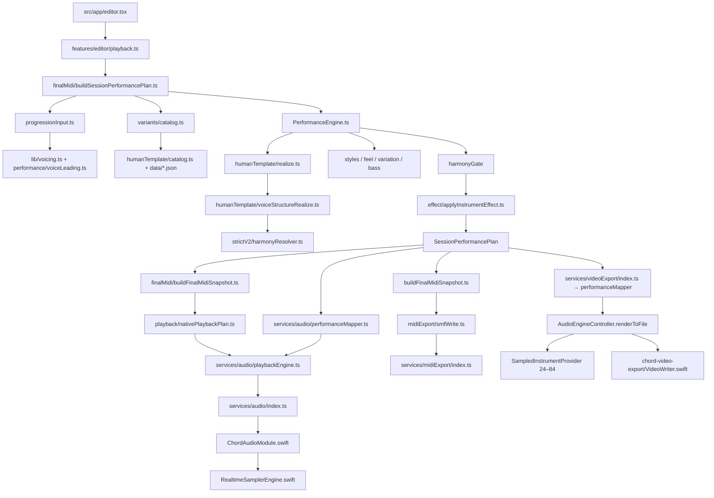

# Chord Palette — Architecture Quality Map

監査日: 2026-08-15  
対象ブランチ: `quality/autonomous-pdca`  
目的: 伴奏品質PoC・分析コード追加後のProduction Source of Truth、到達依存、重複責務を可視化する。  
方針: 本監査では削除・移動・Production実装変更を行わない。

## 1. 判定基準

- **PRODUCTION**: 公開画面、保存済みプロジェクト互換経路、Playback/MIDI/Video Exportから実行到達する。
- **EXPERIMENTAL**: PoC・Listening候補・研究中の実装。Productionから直接呼ばれないことが前提。
- **ANALYSIS_ONLY**: QA、集計、データ抽出、証跡生成。Production生成ロジックを呼ぶことはあるが、Productionから逆向きには呼ばれない。
- **DEPRECATED**: 現在のProduction Source of Truthではない旧実装。互換・比較・回帰のため残存する。
- **Production reachable** は通常の公開経路だけでなく、管理者画面・Build環境変数・保存済みID互換経路も含める。
- **Source of truth** はProductionの同一責務に対する正規実装かを示す。
- **Safe to delete later** は、現在すぐ削除可能という意味ではない。`yes` の項目も参照テスト・スクリプト・保存データの移行後に限る。

## 2. 監査結論

1. 公開Editor PlaybackとMIDI Exportには明確な正規経路がある。
2. Productionコードから `LocalAnalysis`、`LocalDatasets`、Preference実験、POP909 Offline Analyzer、Blind Candidate Generator、Natural Atomic PoCへの禁止Importは検出されなかった。
3. 現在のProduction Naturalは `humanTemplate/realize.ts` → `voiceStructureRealize.ts` であり、`naturalAtomic/` はProduction未到達である。
4. 同一責務の旧実装・PoC・分析実装が `src/lib` 内に同居しており、Import先を誤るリスクは高い。
5. 最重要の到達グラフ分岐はVideo Exportである。Editor PlaybackはFinal MIDI → realtime samplerを使うが、Video音声はFinal MIDIを経由せずlegacy sampled offline rendererを使う。

## 3. Production reachable graph



### Natural Type1–3の実行分岐

`buildSessionPerformancePlan` は `resolveVariant(...).humanTemplateId` を選び、`PerformanceEngine` はHuman Templateがある場合に通常のchord/top/bass strikesを破棄して `realizeHumanTemplate` の結果へ置換する。したがって公開Natural Type1–3のpitch/voice continuityは以下が正である。

```text
variants/catalog.ts
  → humanTemplate/catalog.ts
  → humanTemplate/realize.ts (pitchMode=userChord)
  → humanTemplate/voiceStructureRealize.ts
  → harmonyGate
  → effect
  → SessionPerformancePlan
```

`feel/naturalBank.ts`、`styles/naturalComp*.ts`、`performance/bass/*` はEngineへImportされるが、Human Template Naturalの最終piano eventsには採用されない。

## 4. Hard-rule dependency check

- `src/**` → `LocalAnalysis/**`: **PASS**。テスト内の出力先文字列を除き、Production Importなし。
- `src/**` → `LocalDatasets/**`: **PASS**。Teacher forensic test内のファイルパスを除き、Production Importなし。
- Production → `src/lib/accompanimentQuality/**`: **PASS**。同ディレクトリ内とテスト・scriptsからのみ参照。
- Production → `src/lib/groovePreference/**`: **PASS**。scriptsと同ディレクトリ内からのみ参照。
- Production → POP909 offline analyzer / prior: **PASS**。`scripts/pop909/**`、`accompanimentQuality/**`、テストに限定。
- Production → Blind candidate generators: **PASS**。`candidateFactory.ts`、`preferenceCandidates.ts`、`groovePreference/buildCandidates.ts`はProduction未到達。
- Production → `src/lib/performance/naturalAtomic/**`: **PASS**。専用テストと`naturalAtomicPoc.harness.ts`だけが参照。
- Production → `scripts/**`: **PASS**。逆向きImportなし。

注意: `src/app/listening-v101.tsx` は管理者限定だがProduction bundle内の実ルートであり、診断用fixtureとsampled/sequencer切替をProduction到達可能にする。

## 5. PRODUCTION

### P-01 Public accompaniment policy

- **Path**: `src/lib/performance/publicAccompaniment.ts`, `src/lib/performance/variants/catalog.ts`
- **Purpose**: 公開PatternをBlock/Naturalへ制限し、Natural Type1–3とTeacher IDを解決する。
- **Imported by**: Editor session/UI、`buildSessionPerformancePlan.ts`。
- **Imports**: Variant catalog、Human Template catalog、旧Natural style bank。
- **Production reachable**: yes
- **Source of truth**: yes。公開Patternは`publicAccompaniment.ts`、Type→Teacherは`variants/catalog.ts`。
- **Safe to delete later**: no
- **Replacement if deprecated**: n/a

### P-02 Canonical session performance builder

- **Path**: `src/lib/performance/finalMidi/buildSessionPerformancePlan.ts`
- **Purpose**: SessionからPlayback/MIDI/Video共通の`SessionPerformancePlan`を一度だけ構築する。
- **Imported by**: Editor playback、MIDI export、Video export、MIDI QA、各種回帰テスト。
- **Imports**: progression adapter、variant、PerformanceEngine、harmonyGate、instrument effect、drum resolver。
- **Production reachable**: yes
- **Source of truth**: yes
- **Safe to delete later**: no
- **Replacement if deprecated**: n/a

### P-03 Chord spelling and initial progression voicing

- **Path**: `src/lib/voicing.ts`, `src/lib/performance/voiceLeading.ts`, `src/lib/performance/progressionInput.ts`
- **Purpose**: User chordを合法tone、root/slash bass、voice-led bodyへ変換して`PerfChord[]`を作る。
- **Imported by**: `buildSessionPerformancePlan.ts`、single-chord preview。
- **Imports**: Theory definitions、voicing color、key data。
- **Production reachable**: yes
- **Source of truth**: yes。Chord intervalの最終定義は`src/lib/theory/definitions`。
- **Safe to delete later**: no
- **Replacement if deprecated**: n/a

### P-04 Performance orchestration

- **Path**: `src/lib/performance/PerformanceEngine.ts`
- **Purpose**: Style/Groove/Bass/Variation/Human Templateを選択し、deterministic `NoteEvent[]`を生成する。
- **Imported by**: `buildSessionPerformancePlan.ts`、tests。
- **Imports**: styles、feel、variation、bass、library、humanTemplate、energy、timing、velocity。
- **Production reachable**: yes
- **Source of truth**: yes。経路選択の正規orchestrator。
- **Safe to delete later**: no
- **Replacement if deprecated**: n/a

### P-05 Teacher Template registry and normalized timeline

- **Path**: `src/lib/performance/humanTemplate/catalog.ts`, `types.ts`, `data/*.json`
- **Purpose**: Natural/Variation/BalladのTeacher take、attack、duration、velocity、pedal、source metadataを供給する。
- **Imported by**: Variant catalog、Human Template realizer、Final MIDI pedal exporter、QA。
- **Imports**: Raw JSON、template normalizer、degree compiler。
- **Production reachable**: yes
- **Source of truth**: yes。Production Type→Teacher takeの正規registry。
- **Safe to delete later**: no
- **Replacement if deprecated**: n/a

### P-06 Production Human Template realizer

- **Path**: `src/lib/performance/humanTemplate/realize.ts`
- **Purpose**: Teacher timing/duration/velocityをUser chordへ実現する。Production defaultは`userChord`。
- **Imported by**: `PerformanceEngine.ts`。
- **Imports**: `voiceStructureRealize.ts`、AllowedToneSet、Teacher velocity、回帰用teacherFidelity helper。
- **Production reachable**: yes
- **Source of truth**: yes。現在のNatural/Variation pitch realization入口。
- **Safe to delete later**: no
- **Replacement if deprecated**: 将来Atomicが採用された場合のみ`naturalAtomic/realize.ts`候補。

### P-07 Production Voice Structure realizer

- **Path**: `src/lib/performance/humanTemplate/voiceStructureRealize.ts`, `voiceStructure.ts`, `degreeRoles.ts`
- **Purpose**: User chord内の合法候補を生成し、Teacher spacing/voice roleと前Voicingからattack単位で選択する。
- **Imported by**: `humanTemplate/realize.ts`。
- **Imports**: Harmony degree roles、Teacher voice slots、AllowedToneSet。
- **Production reachable**: yes
- **Source of truth**: yes。現在のProduction Natural pitch/continuity scorer。
- **Safe to delete later**: no
- **Replacement if deprecated**: Atomic Full Voicing modelがListening採用された場合に限る。

### P-08 Harmony enforcement

- **Path**: `src/lib/performance/strictV2/harmonyResolver.ts`, `src/lib/performance/harmonyGate/**`
- **Purpose**: User chord合法pitch classを定義し、生成後の違反を検出する。Pitch修復はしない。
- **Imported by**: Human realizer、Session builder、tests。
- **Imports**: Chord harmony input、NoteEvent。
- **Production reachable**: yes
- **Source of truth**: yes
- **Safe to delete later**: no
- **Replacement if deprecated**: n/a

### P-09 Instrument effect and sustain policy

- **Path**: `src/lib/performance/effect/**`, `src/lib/performance/releaseCut.ts`
- **Purpose**: Note durationによるsustain/release cutを適用し、公開UIをsustainへ固定する。
- **Imported by**: Session builder、Editor session/UI。
- **Imports**: NoteEvent。
- **Production reachable**: yes
- **Source of truth**: yes。Note-length effectの正規実装。
- **Safe to delete later**: no
- **Replacement if deprecated**: n/a

### P-10 Final MIDI snapshot

- **Path**: `src/lib/performance/finalMidi/buildFinalMidiSnapshot.ts`, `pedalCcFromTemplate.ts`, `types.ts`
- **Purpose**: Note/CC64/marker/drumをPlaybackとMIDI Exportが共有できるcanonical snapshotへ変換する。
- **Imported by**: Playback engine adapter、MIDI export、QA、tests。
- **Imports**: SessionPerformancePlan、Human Template pedal、drum kit。
- **Production reachable**: yes
- **Source of truth**: yes。Editor realtime playbackとMIDI Exportの音楽イベントの正。
- **Safe to delete later**: no
- **Replacement if deprecated**: n/a

### P-11 Editor playback request

- **Path**: `src/features/editor/playback.ts`, `src/services/audio/performanceMapper.ts`
- **Purpose**: Session planをlegacy-compatible chordEventsへ変換し、同じplanからnative Final MIDI payloadを付与する。
- **Imported by**: `src/app/editor.tsx`、live reapply、preset preview、Listening screen。
- **Imports**: Session builder、count-in、playback engine adapter。
- **Production reachable**: yes
- **Source of truth**: yes。通常Playback requestの唯一の構築入口。
- **Safe to delete later**: no
- **Replacement if deprecated**: n/a

### P-12 Playback engine policy and native plan

- **Path**: `src/services/audio/playbackEngine.ts`, `src/lib/playback/nativePlaybackPlan.ts`
- **Purpose**: Default engineを`sequencer`へ決定し、Final MIDIをNoteOn/Off/CC64 scheduleへ一度だけflattenする。
- **Imported by**: Editor playback、管理者Listening screen、tests。
- **Imports**: Final MIDI snapshot、SMF writer。
- **Production reachable**: yes
- **Source of truth**: yes。通常Editor Playbackのengine policyとnative schedule。
- **Safe to delete later**: no
- **Replacement if deprecated**: n/a

### P-13 Audio service and realtime native engine

- **Path**: `src/services/audio/index.ts`, `modules/chord-audio/ios/ChordAudioModule.swift`, `RealtimeSamplerEngine.swift`, `SamePitchNoteGate.swift`
- **Purpose**: JS/native境界、transport、AVAudioUnitSampler scheduling、CC64、same-pitch overlapを処理する。
- **Imported by**: Editor、video export、listening screen。
- **Imports**: Native module、SoundFont、AVFoundation。
- **Production reachable**: yes
- **Source of truth**: yes。通常Editor realtime playbackは`RealtimeSamplerEngine`。
- **Safe to delete later**: no
- **Replacement if deprecated**: n/a

### P-14 MIDI Export

- **Path**: `src/services/midiExport/index.ts`, `src/lib/midiExport/**`
- **Purpose**: Session plan→Final MIDI→validated SMF→Share Sheet。
- **Imported by**: `features/export/useMidiExport.ts`。
- **Imports**: Session builder、Final MIDI builder、validator、SMF writer。
- **Production reachable**: yes
- **Source of truth**: yes。Export MIDI。
- **Safe to delete later**: no
- **Replacement if deprecated**: n/a

### P-15 Video Export audio path

- **Path**: `src/services/videoExport/index.ts`, `AudioEngineController.renderToFile`, `VideoWriter.swift`
- **Purpose**: Session planからoffline audioを作り、動画とmuxする。
- **Imported by**: Export screen/service。
- **Imports**: Session builder、performanceMapper、AudioService、legacy sampled offline renderer。
- **Production reachable**: yes
- **Source of truth**: no。Session generationは共通だが、audio renderingはFinal MIDI/realtime playback pathを迂回する。
- **Safe to delete later**: no
- **Replacement if deprecated**: Final MIDI scheduleを直接offline renderする単一renderer。

### P-16 Classic style/bass compatibility engine

- **Path**: `src/lib/performance/styles/**`, `feel/**`, `variation/**`, `bass/**`
- **Purpose**: Block、旧style ID、非Human Template accompanimentのrhythm/bass/variationを生成する。
- **Imported by**: `PerformanceEngine.ts`, variant catalog。
- **Imports**: style types、RNG、PerfChord。
- **Production reachable**: yes。Blockと保存済み/内部style互換。
- **Source of truth**: yes（非Human Template pathのみ）
- **Safe to delete later**: no
- **Replacement if deprecated**: Pattern/保存ID migration後に責務単位で判断。

## 6. EXPERIMENTAL

### E-01 Natural Atomic Full Voicing + Mask PoC

- **Path**: `src/lib/performance/naturalAtomic/**`
- **Purpose**: Stable Full Voicing、LEFT/RIGHT hand role、attack-group mask、color presenceを検証する。
- **Imported by**: 専用test、`scripts/audition/naturalAtomicPoc.harness.ts`。
- **Imports**: Production PerfChord/Human Template/Final MIDI types。Production側からのImportなし。
- **Production reachable**: no
- **Source of truth**: no
- **Safe to delete later**: yes。未採用で実験終了する場合。
- **Replacement if deprecated**: 現Production `humanTemplate/realize.ts` + `voiceStructureRealize.ts`。

### E-02 Human Preference experiment

- **Path**: `src/lib/accompanimentQuality/preference*.ts`, `analyzePreference.ts`, `firstListeningSeed.ts`, `listeningTypes.ts`
- **Purpose**: Blind ranking、pairwise preference、feature差、accuracyを分析する。
- **Imported by**: `scripts/preference/**`、同ディレクトリtests。
- **Imports**: POP outlier rejector、voicing transition features、hard gate。
- **Production reachable**: no
- **Source of truth**: no
- **Safe to delete later**: yes。Dataset/結果を保存し、Production modelへ採用しない場合。
- **Replacement if deprecated**: Production採用時は独立したversioned scorer/serviceを新設する。

### E-03 Groove Preference experiment

- **Path**: `src/lib/groovePreference/**`
- **Purpose**: Teacher timeline固定のGroove candidate生成、controlled difference検証、pairwise分析。
- **Imported by**: `scripts/groovePreference/**`、専用tests。
- **Imports**: 固定voicing progression、Teacher timeline、candidate strategies、Final MIDI snapshot adapter。
- **Production reachable**: no
- **Source of truth**: no
- **Safe to delete later**: yes。実験終了・証跡保存後。
- **Replacement if deprecated**: 採用するGroove AssetをProduction humanTemplate/groove domainへ移植する。

### E-04 Current blind candidate generators

- **Path**: `accompanimentQuality/preferenceCandidates.ts`, `groovePreference/buildCandidates.ts`
- **Purpose**: Human listening用にlabelをshuffleし、複数候補を生成する。
- **Imported by**: collect/analyze harness。
- **Imports**: hard gates、feature extraction、outlier rejector、strategy registry。
- **Production reachable**: no
- **Source of truth**: no
- **Safe to delete later**: yes
- **Replacement if deprecated**: Versioned offline experiment package。

### E-05 Admin listening route

- **Path**: `src/app/listening-v101.tsx`, `src/lib/playback/phase3cCases.ts`, `humanTemplate/listeningProgression.ts`
- **Purpose**: 実機でsampled/sequencer、Natural/Variationを比較する。
- **Imported by**: Admin-only home link。
- **Imports**: Production editor playback、diagnostic fixture、engine override。
- **Production reachable**: yes。管理者モード限定だがapp routeとしてbundleされる。
- **Source of truth**: no
- **Safe to delete later**: yes。Release診断終了後。
- **Replacement if deprecated**: 外部development buildまたはtest-only route。

## 7. ANALYSIS_ONLY

### A-01 MIDI QA

- **Path**: `src/lib/midiQa/**`, `scripts/midiQa/**`
- **Purpose**: Production Session/Final MIDIを再生成し、harmony/structure/transpose/golden差を検査する。
- **Imported by**: MIDI QA harness、quality isolation harness、tests。
- **Imports**: Production Session builder、Final MIDI builder、SMF writer。
- **Production reachable**: no
- **Source of truth**: no。Generatorを再実装せずProductionを観測する点は正しい。
- **Safe to delete later**: no。Release regression gateとして必要。
- **Replacement if deprecated**: CI用QA package。

### A-02 Performance analysis utilities

- **Path**: `src/lib/performance/analysis/**`
- **Purpose**: Metrics、fixture、baseline、playback fidelity report。
- **Imported by**: tests、audition harness。
- **Imports**: NoteEvent/Performance output。
- **Production reachable**: no
- **Source of truth**: no
- **Safe to delete later**: no。品質回帰に利用中。
- **Replacement if deprecated**: 独立`tools/quality` package。

### A-03 POP909 analyzer and prior

- **Path**: `src/lib/accompanimentQuality/pop909Chords.ts`, `extractSong.ts`, `popPrior.ts`, `popVoicingFeatures.ts`, `popOutlierRejector.ts`, `assets/quality/pop909_prior_v1.json`, `scripts/pop909/**`
- **Purpose**: POP909 chord/voicing分布を抽出し、極端なoutlierだけを警告/Rejectする。
- **Imported by**: POP909 scripts、Preference experiment、tests。
- **Imports**: SMF parser、transition feature types。
- **Production reachable**: no
- **Source of truth**: no
- **Safe to delete later**: yes。Priorと再生成手順を別途保存した後。
- **Replacement if deprecated**: Versioned offline prior artifact。

### A-04 Teacher forensic regression

- **Path**: `humanTemplate/__tests__/identityFidelity.test.ts`, `pureTransposePhase2.test.ts`, `userChordPhase3a.test.ts`, `phase3dVoiceStructure.test.ts`, `playback/__tests__/phase3cPlaybackFidelity.test.ts`
- **Purpose**: LocalDatasets MIDIとProduction/teacherFidelityを比較し、LocalAnalysisへ証跡を出す。
- **Imported by**: Jestのみ。
- **Imports**: Node fs/path、LocalDatasets path、Production realizer/Final MIDI。
- **Production reachable**: no
- **Source of truth**: no
- **Safe to delete later**: no。Production Voice Structure回帰の重要証跡。
- **Replacement if deprecated**: 明示的`tools/forensic` packageへ移動。

### A-05 Audition and isolation harness

- **Path**: `scripts/audition/audition.harness.ts`, `playbackRegression.harness.ts`, `qualityIsolation.harness.ts`, `simplePreviewWav.ts`
- **Purpose**: Teacher/Final MIDI/native planの切り分け、WAV/MIDI証跡生成。
- **Imported by**: npm audition commandsのみ。
- **Imports**: Production generator、MIDI QA、analysis utilities。
- **Production reachable**: no
- **Source of truth**: no
- **Safe to delete later**: no。Playback/quality診断に利用中。
- **Replacement if deprecated**: 統合quality CLI。

### A-06 Local data and evidence

- **Path**: `LocalDatasets/**`, `LocalAnalysis/**`
- **Purpose**: 入力datasetと生成証跡。コードではない。
- **Imported by**: Test/harnessのruntime file pathのみ。
- **Imports**: none
- **Production reachable**: no
- **Source of truth**: no。Production assetではない。
- **Safe to delete later**: yes。再生成可能性とライセンス証跡を確認後。
- **Replacement if deprecated**: External/versioned artifact storage。

### A-07 Research documentation

- **Path**: `docs/chord_palette_preference_score.md`, `docs/groove_preference_round1.md`, `docs/pop909_quality_prior.md`, `docs/performance/analysis/**`, `docs/data_collection/**`
- **Purpose**: 実験契約、判断根拠、dataset policy、分析結果。
- **Imported by**: Runtime importなし。
- **Imports**: n/a
- **Production reachable**: no
- **Source of truth**: no。Product requirementの正ではなく研究記録。
- **Safe to delete later**: no。判断履歴として保持。
- **Replacement if deprecated**: Archive docs。

## 8. DEPRECATED

### D-01 Phase 3A nearest-fit User Chord voicing

- **Path**: `src/lib/performance/humanTemplate/userChordVoicing.ts`
- **Purpose**: Teacher noteをAllowedToneSetへnearest-fitする旧attack realizer。
- **Imported by**: Barrel exportと専用testのみ。
- **Imports**: strictV2 optimizer/register policy。
- **Production reachable**: no
- **Source of truth**: no
- **Safe to delete later**: yes
- **Replacement if deprecated**: `humanTemplate/voiceStructureRealize.ts`。

### D-02 Strict V2 generic voicing optimizer

- **Path**: `src/lib/performance/strictV2/voicingOptimizer.ts`, `registerPolicy.ts`
- **Purpose**: TemplateNote単位candidate/scoringの旧汎用optimizer。
- **Imported by**: strictV2 barrelとtests。Production Human realizerからは未参照。
- **Imports**: harmonyResolver、register policy。
- **Production reachable**: no
- **Source of truth**: no
- **Safe to delete later**: yes。依存testとD-01整理後。
- **Replacement if deprecated**: `voiceStructureRealize.ts`。

### D-03 POP909 best-candidate scorer

- **Path**: `src/lib/accompanimentQuality/popVoicingScore.ts`
- **Purpose**: POP909 median寄りを高評価する旧PoC scorer。
- **Imported by**: 旧candidateFactory、Preference分析script、tests。
- **Imports**: POP prior/features。
- **Production reachable**: no
- **Source of truth**: no
- **Safe to delete later**: yes。分析scriptから旧score表示を除去後。
- **Replacement if deprecated**: `popOutlierRejector.ts`。最終順位はHuman Preference側。

### D-04 Fixed X/Y/Z candidate factory

- **Path**: `src/lib/accompanimentQuality/candidateFactory.ts`
- **Purpose**: C-Am-F-G固定High/Mid/Low candidateを作る初期POP909 PoC。
- **Imported by**: 旧POP PoC、hard gate tests。
- **Imports**: popVoicingScore、Final MIDI/SMF writer。
- **Production reachable**: no
- **Source of truth**: no
- **Safe to delete later**: yes
- **Replacement if deprecated**: `preferenceCandidates.ts`またはNatural Atomic harness。

### D-05 Legacy LibraryPattern path

- **Path**: `src/lib/performance/library/**`
- **Purpose**: Ballad LibraryPattern ingest/realizationの旧opt-in path。
- **Imported by**: `PerformanceEngine.ts`とtests。
- **Imports**: Pattern catalog、relative-note realizer。
- **Production reachable**: no。`buildSessionPerformancePlan`は`libraryPatternId`を渡さない。
- **Source of truth**: no
- **Safe to delete later**: yes。外部caller/保存データにIDがないことを確認後。
- **Replacement if deprecated**: Human MIDI Template path。

### D-06 Hidden Natural style banks

- **Path**: `feel/naturalBank.ts`, `styles/naturalComp.ts`, `naturalCompSparse.ts`, `naturalCompDense.ts`, hidden `natural.auto/steady/sparse/dense`
- **Purpose**: Human Template導入前のNatural skeleton/bank。
- **Imported by**: Variant catalog、PerformanceEngine。
- **Imports**: StylePreset/feel。
- **Production reachable**: yes（bundle/保存ID互換）。ただしSession builderのHuman Template fallbackが最終piano eventsを置換する。
- **Source of truth**: no。公開Natural Type1–3の正ではない。
- **Safe to delete later**: no。保存variant ID移行とfallback挙動整理が先。
- **Replacement if deprecated**: `humanTemplate/catalog.ts` + `voiceStructureRealize.ts`。

### D-07 Sampled realtime playback path

- **Path**: `SampledInstrumentProvider.swift`, `AudioEngineController` v1 render callback、`engine="sampled"`
- **Purpose**: 24–84の事前録音bufferを合算する旧Playback。
- **Imported by**: Native controller、admin listening、build/runtime override。Offline Video rendererも同providerを使用。
- **Imports**: AVAudioEngine offline capture、Mixer、Scheduler。
- **Production reachable**: yes
- **Source of truth**: no。通常Editor Playbackはsequencer。
- **Safe to delete later**: no。Video offline renderとdiagnostic fallbackを先に置換する必要がある。
- **Replacement if deprecated**: Final MIDI faithful realtime/offline sampler。

## 9. CONFLICT — duplicate responsibility risks

### C-01 Multiple Natural pitch realizers — HIGH

- Production: `humanTemplate/realize.ts` → `voiceStructureRealize.ts`
- Experimental: `naturalAtomic/realize.ts` → `fullVoicing.ts`
- Deprecated: `humanTemplate/userChordVoicing.ts`
- Analysis-only: `strictV2/voicingOptimizer.ts`
- Risk: すべてが`src/lib/performance`配下にあり、名称だけではProduction pathを判断しにくい。
- Current resolution: Production Source of Truthは`voiceStructureRealize.ts`。AtomicはListening採用まで未到達。

### C-02 Multiple voicing scorers — HIGH

- `voiceLeading.ts`: progression bodyの基礎voice leading。
- `voiceStructureRealize.scoreCandidate`: Production Human Template。
- `strictV2/voicingOptimizer.scoreVoicing`: 旧/分析。
- `naturalAtomic/fullVoicing.voicingCost`: PoC。
- `popVoicingScore.ts`: 廃止済みPOP ranker。
- `preferenceFeatures/analyzePreference`: Human preference分析。
- Risk: 同名Featureでも評価対象がbody、attack、full voicing、dataset transitionで異なる。Productionへの誤Import余地がある。

### C-03 Multiple bass generators — MEDIUM

- `lib/voicing.ts`: root/slash bassをPerfChordへ置く。
- `PerformanceEngine.bassPitch` + `performance/bass/planBassLine`: classic style bass。
- `voiceStructureRealize.ts`: Human Template attack内のbass/lowest slot。
- `naturalAtomic/fullVoicing.ts`: PoC LEFT role。
- Current resolution: Human Template NaturalではEngineのclassic bass eventsを最終的に破棄し、Voice Structure側が実音を決める。
- Risk: PerfChord bassと最終Natural bassが同一とは限らず、どの層がbassの正かがstyle依存。

### C-04 Multiple sustain representations — HIGH

- Note duration/gate: PerformanceEngine + `applyInstrumentEffect`。
- Teacher pedal: `pedalCcFromHumanTemplate` → Final MIDI CC64。
- Realtime physical sustain: `RealtimeSamplerEngine`。
- Legacy sampled/offline render: durationのみでCC64を受け取らない。
- Current resolution: Editor sequencer/MIDIではFinal MIDIが正。
- Risk: Video/legacy sampledでは同じsustain contractにならない。

### C-05 Multiple playback engines — HIGH

- Default: `services/audio/playbackEngine.ts` → sequencer。
- Legacy override: sampled（build env、runtime admin screen、native default fallback）。
- Offline Video: sampled provider/render callbackのみ。
- Stale comments: `listening-v101.tsx`とnative controllerの一部コメントはsampledをshipping pathと記述する。
- Risk: 「Production playback engine」の回答がcallerごとに異なる。

### C-06 Final MIDI bypass in Video Export — RELEASE-BLOCKER CANDIDATE

- Editor Playback: Session plan → Final MIDI → Native MIDI schedule → Realtime sampler。
- MIDI Export: Session plan → Final MIDI → SMF。
- Video: Session plan → legacy chordEvents → `renderToFile` → sampled provider。
- Confirmed differences:
  - Video request/bridgeはCC64を運ばない。
  - `SampledInstrumentProvider.sample`は24–84へpitchをclampする。
  - `RenderAudioRequestRecord`に`drumMode`がなく、TSで指定したoff/clapがnative offline renderへ渡らない。
- Risk: 「聞こえたもの = MIDI = Video」のcontractがVideoだけ成立しない可能性がある。
- Action: 本監査では変更しない。Release前にVideoのCC64、high register、drum off/clapを実機確認し、FAILならP0修正。

### C-07 Public accompaniment surface ambiguity — MEDIUM

- Runtime policy: `publicAccompaniment.ts`はBlock/Naturalのみ。
- Variant catalog comment: Block/Natural/VariationをProduction提供と記述。
- Engine/catalog: Variationと多数の非公開styleを保持。
- Current resolution: 公開可否のSource of Truthは`publicAccompaniment.ts`。
- Risk: コメント・QA catalog・UI expectationがずれる。

### C-08 Experiment barrel ambiguity — MEDIUM

- `accompanimentQuality/index.ts`がcurrent preference、POP outlier、deprecated POP score、deprecated candidateFactoryを同時exportする。
- Risk: Offline script追加時に旧rankerを「正規API」と誤認しやすい。
- Current resolution: Production importは0。将来、`experimental/preference`と`analysis/pop909`へbarrelを分離する。

## 10. Final report

### A. Production source of truth

1. 公開範囲: `performance/publicAccompaniment.ts`
2. Type→Teacher: `performance/variants/catalog.ts` + `humanTemplate/catalog.ts`
3. Session生成: `finalMidi/buildSessionPerformancePlan.ts`
4. Chord定義: `theory/definitions` + `humanTemplate/chordHarmony.ts`
5. Production Natural pitch: `humanTemplate/realize.ts` + `voiceStructureRealize.ts`
6. Legal harmony: `strictV2/harmonyResolver.ts` + `harmonyGate`
7. Note effect: `performance/effect/applyInstrumentEffect.ts`
8. Canonical MIDI: `finalMidi/buildFinalMidiSnapshot.ts`
9. Editor playback schedule: `playback/nativePlaybackPlan.ts`
10. Default engine: `services/audio/playbackEngine.ts` → `RealtimeSamplerEngine.swift`
11. MIDI export: `services/midiExport/index.ts`

### B. Experimental branches

- Natural Atomic Full Voicing + Mask。
- Human Preference / POP outlier candidate analysis。
- Groove Preference candidate strategies。
- Admin listening routeとengine A/B。
- Blind listening/PoC harness群。

### C. Deprecated paths

- `humanTemplate/userChordVoicing.ts`
- `strictV2/voicingOptimizer.ts`
- `accompanimentQuality/popVoicingScore.ts`のBest Ranker用途
- `accompanimentQuality/candidateFactory.ts`
- `performance/library/**`
- hidden Natural style banks
- sampled realtime playback path

### D. Duplicate-responsibility risks

- Natural realizer、voicing scorer、bass generator、sustain、playback engine、candidate APIに複数実装がある。
- Runtime Production Naturalは一意だが、source tree上は区別しにくい。
- 最優先の将来整理は「Production」「experimental」「analysis」「deprecated」の物理directory/barrel分離であり、今すぐの大規模refactorは不要。

### E. Releaseへの影響

- 禁止Import混入: **なし**。
- Editor Playback/MIDI ExportのSource of Truth: **明確**。
- Natural Atomic PoCの誤出荷: **なし**。
- Sampled engineの通常Editor default化: **なし**。sequencerがdefault。
- Video Export fidelity: **要確認・Release-blocker候補**。Final MIDI/CC64/drumModeを迂回する。
- 推奨する次の行動: コード整理ではなく、Videoの`CC64 / pitch > 84 / drum off / clap`だけを対象にした実機またはnative integration QAを先に行う。
