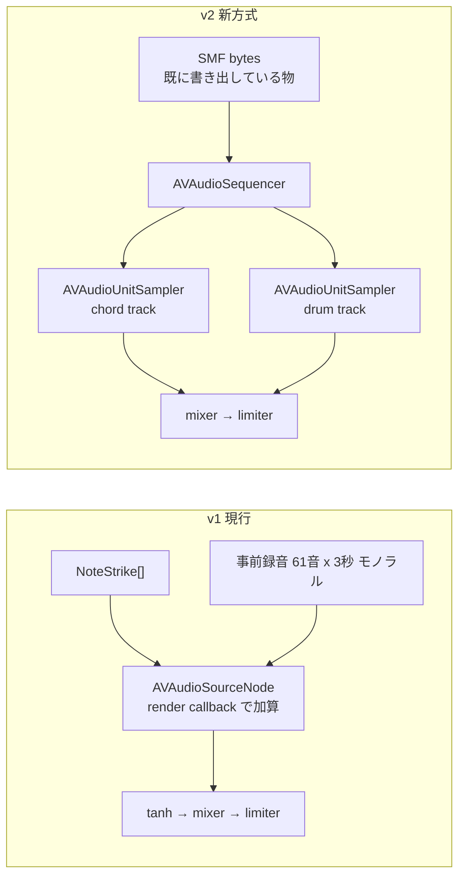

# 再生層の作り直し — Playback v2 設計

`docs/audio/sound_path_v1.md` で特定した再生層の制約を、事前録音方式をやめることで根本から消す。この文書は移植の設計判断だけを扱う。生成層の話は含まない。

## 何を変えるのか

現行 (v1) と新方式 (v2) の違いは一点に集約される。**`AVAudioUnitSampler` を「録音してから読み出す装置」として使うのをやめ、音を出すノードとしてエンジンに接続する。**

v2 が構造的に解決するもの。

- velocity がサンプラーに届くので、SF2 の velocity 層が効く（強弱で音色が変わる）
- ノートオフとリリースをサンプラーが持つので、3 秒の打ち切りが消える
- 音域制限が消える（クランプによる別音の発音がなくなる）
- ステレオのまま鳴る
- CC64 がサンプラーに直接届く。JS 側でノート長を伸ばして代用する必要がなくなる
- ポリフォニー管理を Apple に任せられる
- 音色切替が SF2 ロードだけになり、61 音の事前レンダリングが不要になる
- ドラムのパターン定義を Swift と TypeScript で二重管理する必要がなくなる（SMF に入っているものが鳴る）

## 入力を SMF に統一する

v2 は再生プランを SMF バイト列として受け取る。理由は 3 つ。

1. `buildFinalMidiSnapshot` → `writeSmf` は既にあり、MIDI 書き出しで使っている。同じバイト列を鳴らせば「聴いた音 = 書き出した音」が規約ではなく構造として保証される
2. `AVAudioSequencer.load(from:options:)` が Data を直接受けるので、ネイティブ側にイベント変換コードが要らない
3. ドラムがチャンネル 9 のノートとして SMF に入っているので、パーカッションバンクを載せた 2 本目のサンプラーに流すだけでよい

JS 側の追加は `PlaybackRequest` に `smfBase64?: string` を足すだけで、既存フィールドは触らない。v1 の経路は `smfBase64` を無視するので後方互換が保たれる。

## トランスポートの移植

自前スケジューラが担っていた責務を `AVAudioSequencer` にどう移すか。ここが移植の主リスクなので、対応を 1 つずつ確定させる。

- **play**: `sequencer.prepareToPlay()` → `start()`。エンジンは既に起動済みである必要がある（現行の `prepare()` の流れをそのまま使う）
- **pause**: `sequencer.stop()`。`currentPositionInBeats` は保持されるので、再開位置の管理を自前で持たない
- **resume**: `start()` を呼ぶだけ。位置は保持されている
- **stop**: `stop()` + `currentPositionInBeats = 0`
- **seek / startBeat**: `sequencer.currentPositionInBeats = startBeat`。現行の「フレームカウンタを直接書く」処理と等価
- **loop**: 各 `AVMusicTrack` の `isLoopingEnabled = true` と `loopRange` を `0..<totalBeats` に設定する。現行の `Scheduler.fold` は不要になる
- **再生ヘッド通知**: `getCurrentBeat()` は `sequencer.currentPositionInBeats` を返す。現行はフレーム数から逆算していた。UI 用途のみで音のクロックには使わないという原則（types.ts の `PositionEvent` のコメント）は変わらない
- **ライブ再適用（音色・グルーヴの差し替え）**: 現行は `PlanSnapshot` をロック下で差し替え、`startBeat` を渡して再生し直していた。v2 も同じ形にする。すなわち「現在の `currentPositionInBeats` を読む → 新しい SMF をロードする → 位置を書き戻す → `start()`」。サンプラーの SF2 差し替えだけで済む場合（音色変更のみ）はシーケンスを再ロードしない
- **音量**: 現行の `Mixer`（chord / drum の 2 バス + マスター）はそのまま使える。サンプラーを対応するバスに接続するだけ
- **オフラインレンダリング（動画書き出し）**: `AVAudioEngine.enableManualRenderingMode(.offline)` と `AVAudioSequencer` は併用できる。`SampledInstrumentProvider.load` が既に手動レンダリングモードで SF2 を鳴らしているので、同じ手法をシーケンサに適用する。ループで `durationSec` を埋める処理は `loopRange` に任せる
- **単音プレビュー（コードカードのタップ）**: シーケンサを経由せず、サンプラーに直接 `startNote` / `stopNote` を送る。プレビューは正確なタイミングを必要としないので、これが最も単純

## 段階導入とロールバック

音が出ないことは P0 なので、v2 は**追加**として入れて既定は v1 のままにする。

- 新規ファイル `modules/chord-audio/ios/SequencerPlayer.swift` に v2 を閉じ込める。`AudioEngineController` は「どちらの経路で鳴らすか」を選ぶだけにする
- 選択は `PlaybackRequest.engine`（`'sampled' | 'sequencer'`）で行う。既定は `'sampled'`（v1）
- JS 側は `src/services/audio/playbackEngine.ts` が `EXPO_PUBLIC_PLAYBACK_ENGINE` を読んで決める。設定しなければ v1
- 実機 A/B は環境変数を変えた 2 ビルドで行う。UI には何も追加しない
- v2 が実機で良いと確認できたら、v1 の `SampledInstrumentProvider` / `InstrumentProvider` の pull モデル / `NoteStrike` 加算 / `DrumKit.swift` を削除する。それまでは残す

## 削除できるようになるもの（v2 確定後）

- `SampledInstrumentProvider.swift`（事前録音・flat store・DC ブロック・フェード処理）
- `InstrumentProvider` / `ElectricPianoInstrumentProvider`（SF2 が velocity 層を持つので合成 EP が不要になる）
- `DrumProvider` / `SampledDrumProvider` / `DrumKit.swift` と、その TypeScript ミラー `src/lib/drum/drumKit.ts`
- `AudioEngineController` の `buildStrikes` 系（`emitGrid` / `emitGroup` / `CompStroke` / `humanize` / `timingSway`）。これは Performance Engine 導入前のレガシー伴奏生成がネイティブに残っているもので、`accompaniment: 'performance'` 以外の分岐は現在使われていない
- 独自ソフトクリップ（`tanh`）。サンプラーの出力はマスターリミッタだけで足りる

概算で 1,000 行以上のネイティブコードが消える。これは音質改善と同時に、二重管理と自前 DSP という 2 つのリスク源をなくすことでもある。

## 未確定・要検証

実機で確かめないと判断できない項目。ここを空欄のまま実装完了としない。

- `AVAudioSequencer` のループ境界でノートオフが取りこぼされないか（取りこぼすと音が伸び続ける）
- 手動レンダリングモードでのシーケンサ再生が、実際に同じ音になるか（動画書き出しと再生の一致）
- SF2 差し替え時のグリッチ（`loadSoundBankInstrument` は同期処理で、再生中に呼ぶと途切れる可能性がある）
- FluidR3 のピアノ（program 0）が velocity 層を実際に持っているか。持っていなければ音源そのものを替えないと「機械的」は解消しない。ライセンスを含めた音源選定が別途必要
- チャンネル 9 のドラムを鳴らすためのパーカッションバンク指定（`kAUSampler_DefaultPercussionBankMSB`）が SF2 側に存在するか
