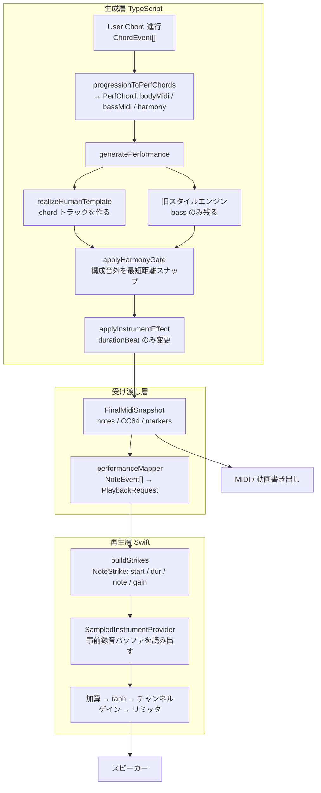

# 音が鳴る原理 — 伴奏が音になるまでの全経路

v1.01 時点の実装を、コードを読んで確認した事実だけで整理したもの。各層が何を決めるのか、どこで音楽的な情報が失われるのかを特定するための資料。推測は「仮説」と明記する。

計測は `npm run audition` で再現できる。進行 A（C - G - Am - F / 120BPM）と進行 D（Dm7 - G7 - Cmaj7 - A7 / 70BPM）の実測値を根拠として引用する。

## 全体像



## 生成層

### 1. コード進行 → PerfChord

`src/lib/performance/progressionInput.ts` が `ChordEvent` を `PerfChord` に変換する。ここで決まるもの。

- `bodyMidi`: 和音本体のボイシング（`voicingAestheticFor` がティア別の美学を適用）
- `bassMidi`: アンカーされたベース音
- `harmony`: ユーザーが選んだコード記号と許容音（Strict v2 用）

`remeterChords` が拍子に合わせて小節長を再割り当てする。

### 2. generatePerformance

`src/lib/performance/PerformanceEngine.ts`。トラックは `chord` / `top` / `bass` / ドラム。

重要な分岐がある。`humanTemplateId` が指定されると、`chord` と `top` の両トラックを**捨てて** `realizeHumanTemplate` の出力に差し替える。

```ts
if (humanTemplate) {
  const realized = realizeHumanTemplate(humanTemplate, input.chords, { ... });
  const kept = events.filter((e) => e.trackId !== 'chord' && e.trackId !== 'top');
  events.length = 0;
  events.push(...kept, ...realized);
}
```

v1.01 でブロック / バラード / アルペジオの全 Type に Human Template を割り当てたため、**UI から選べる全パターンが必ずこの経路を通る**。結果として旧スタイルエンジンがピアノに対して行っていた次の処理が、すべて効かなくなった。

- `renderTrack` のマイクロタイミング（`msToBeat` / `swingDelayBeats` / `trackOffsetMs`）
- ストラム（`strumScale`）とトップ強調
- `pickArticulation` / `computeGate` によるアーティキュレーション
- `computeVelocity` / `avoidFiveInARow` の velocity 造形
- `applyVariation` のフレーズ変化
- `top` トラックそのもの（実測: 全ケースで top のノート数 0）

### 3. realizeHumanTemplate

`src/lib/performance/humanTemplate/realize.ts`。テンプレートから受け取るのは onset・duration・relativeVelocity で、ピッチは `optimizeAttack`（Voicing Optimizer）が許容音の中から選び直す。設計意図どおり「グルーヴは教師、和音はユーザー」になっている。

ただしテンプレートデータ自体に問題がある。`src/lib/performance/humanTemplate/data/*.json` を実測した結果。

- `timingOffsetBeats` は**全アタックで 0**。`fullTimelineAttacks` 側も同じで、`absoluteTick` はちょうど 1920（4 拍 × 480ppq）などグリッド上の値しかない
- onset は 16 分グリッドから 1 つも外れていない（P1_C7 は 0,1,2,3 の 4 分音符のみ。P1_A1 は 0,0.5,1,1.5 の 8 分のみ）
- 一方で `durationBeats` は 1.316667 のような人間の値、`relativeVelocity` は 19 段階、`pedalEvents` は 0.020833 拍のような人間のタイミングを保持している

つまり**取り込み時に onset だけがクオンタイズされ、人間のタイミングが失われている**。ペダルと強弱は生き残っているので、元の演奏は人間のものである。「Human MIDI Template」から人間の時間軸が抜けた状態で、これが「機械的に聴こえる」の直接の原因。計測値でも和音トラックの `timingDeviationMean` は全ケースで 0.000 拍。

### 4. HarmonyGate

`src/lib/performance/harmonyGate/harmonyGate.ts`。ピッチが選択コードの構成音でなければ最短距離でスナップする。

- Human Template 経路では Strict v2 と同じ許容音セットを使うため実質 no-op（実測: 非構成音 0、スナップも発生しない）
- 効いているのはベースの経過音・クロマチックアプローチと、レガシーパターン
- 1 音ずつ独立に判定するため、同時に鳴る他の音を見ていない。同一 onset に同じピッチが重なる状態を作りうる（実測: block で 2〜3、アルペジオで 2〜4 件）

### 5. InstrumentEffect

`src/lib/performance/effect/`。`durationBeat` だけを変更する。ピッチ・onset・velocity は触らない。`releaseCut` のときは書き出し側で CC64 を落とす。

## 受け渡し層

`buildFinalMidiSnapshot` が唯一の正となるイベント列を作り、再生・MIDI 書き出し・動画書き出しがこれを共有する。ドラムだけは例外で、再生時はネイティブの `DrumKit.swift` がパターンを生成し、書き出し時は TypeScript の `drumKit.ts` が生成する。両者は手で同期させたミラーで、`beat4` のような追加のたびに二重管理が発生する。

## 再生層

`modules/chord-audio/ios/`。ここが音質のボトルネック。

### 音の作り方

`SampledInstrumentProvider.swift` は SF2 を `AVAudioUnitSampler` で読み込んだあと、**C1〜C6 の 61 音を「ベロシティ 100・3 秒・ステレオをモノラルにダウンミックス」で 1 回だけオフライン録音**し、以後はその波形を読み出す。`AVAudioUnitSampler` はライブノードとして接続されていない。

この構造から必然的に生じる制約が、報告された症状と一致する。

| 実装上の制約 | 音として現れるもの |
| --- | --- |
| velocity 層が 1 つ。強弱は `gain = velocity/127` の音量スケールのみ | 強く弾いても音色が変わらない = 機械的 |
| `captureSeconds = 3.0`、`if idx >= len { return 0 }` | 3 秒を超えて伸ばした音が途中で無音になる = 音が抜ける |
| `clamped = min(max(note, 24), 84)` | 音域外のピッチが別の音として鳴る = 和音の響きが違う |
| モノラル。書き出しも `ch[0][i] = v; ch[1][i] = v` | 広がりがない = 薄い |
| ノートオフは 30ms フェード。CC64 は音源に届かない | 自然な余韻・ダンパーがない |
| 和音バスで `tanh`、さらにマスターリミッタ | ダイナミクスが二重に潰れる = ペラい |
| 音色切替のたびに 61 音 × 3 秒のオフラインレンダリング | 切替が重い |

### 実測された影響

進行 A / 120BPM、ティア pro、ドラム off での計測。

- バラード（relaxed）の和音音域は 60〜95。サンプラーの上限は 84 なので、**1 テイクあたり 4〜9 音が別の音として鳴る**。最大 11 半音のずれ。生成側の Voicing Optimizer は 36〜96 の範囲で最適化しており（`poolForAttack` / `claritySeed` / `deMudPitches` がいずれも上限 96）、再生側の 84 と食い違っている
- 進行 D / 70BPM では block で 4 音が 3 秒の打ち切りに掛かる。テンポが遅いほど悪化する
- ユニゾン重複は block 2〜3 件、アルペジオ 2〜4 件

## 結論: 生成層と再生層のどちらが原因か

両方だが、症状の担当が分かれている。

再生層に由来するもの。

- 音色が変・安っぽい → velocity 層 1 つ + モノラル + 事前録音
- 音が抜ける・途切れる → 3 秒の打ち切り
- コードの響きが違う → 84 を超えるピッチのクランプ
- ペラい → 二重のダイナミクス圧縮

生成層に由来するもの。

- 機械的 → テンプレートの onset がクオンタイズ済みで、かつ engine 側のマイクロタイミングも通らない
- 薄い → `top` トラックが消滅、バラードの音域が高すぎる
- 和音の濁り → ユニゾン重複

設定伝達層に由来するもの。

- ドラムが曲に合わない → `resolveDrumPatternId` がセッションの `grooveId` を捨てている

## 抜本改善の方向

再生層は事前録音方式をやめ、`AVAudioUnitSampler` をライブノードとして接続して MIDI を送る構成に置き換える。これで velocity 層・自然なリリース・ステレオ・CC64・音域制限なしが一度に手に入り、上の表の制約がすべて消える。移植の要点は `docs/audio/playback_rebuild_v2.md` に分けて記述する。

生成層は、テンプレートの onset にエンジン側のマイクロタイミングを掛け直すこと、音域を再生可能範囲に収めること、ユニゾン重複を作らないことを先に行う。テンプレートの再取り込み（onset のクオンタイズをやめる）は、音源が手元にある前提での別作業。
