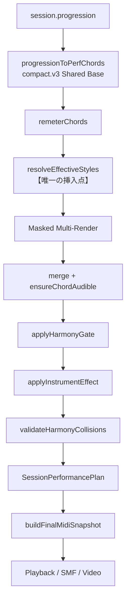

# 10. Per-Chord Accompaniment Style Override - 開発設計仕様書

作成日: 2026-09-25

状態: 最新 1.0.4 RC への P1〜P4 移植・自動検証完了 / iOS 実機再確認待ち
判定: **Conditional Feasible**（必須条件 A〜D を満たすこと）

---

## 0. 前提

### 0.1 確定事項（オーナー判断 2026-09-25）

| 論点 | 決定 |
|---|---|
| STYLE segment 化方式 | **Masked Multi-Render を採用。** 連続同一 STYLE を slice する方式は不採用（理由は §5） |
| append 時の override 継承 | **継承を許可。** 現行 grandfathering 方針と整合。Free での override 新規作成は引き続き不可 |

### 0.2 公開 STYLE の正（仕様上の事実誤認の訂正）

UI 上の表示名と、保存・描画に使う `(pattern, variant)` は一致しない。**表示名を保存値にしてはならない。**

| UI 表示 | pattern | variant | 描画経路 |
|---|---|---|---|
| Block | `block` | `block.type1` | PerformanceEngine 標準 |
| Natural Type 1 | `natural` | `natural.type1` | naturalAtomic |
| Natural Type 2 | `natural` | `natural.type2` | naturalAtomic |
| Variation City | `city` | `city.type1` | City 独立 realizer |
| Variation Funk | `natural` | `natural.type3` | naturalAtomic |
| Variation Driving | `natural` | `natural.type4` | naturalAtomic |
| Variation Dance | `natural` | `natural.dance1` | naturalAtomic |
| Arpeggio Type 1 | `natural` | **`natural.type5`** | naturalAtomic |

特に **「Arpeggio Type 1」は `arpeggio` パターンではない。** `arpeggio.*` はカタログに存在するが全て `offered: false` の非公開であり、override の保存値として許可してはならない。

構造上の帰結として、公開 8 STYLE は実質 3 系統（Block / naturalAtomic / City）であり、うち 6 つは同一 realizer の `variantId` 違いにすぎない。これが本機能の実現性を支えている。

### 0.3 拍子に関する制約

公開 8 STYLE は **全て `beatsPerBar = 4`**。`beatsPerBar` が 3 / 6 になるのは `waltz` / `sixEight` のみで、いずれも非公開。

したがって `beatsPerBar` と remeter はプロジェクト全体で 1 つのまま扱える。この前提が崩れると本設計は成立しないため、条件 D のガードで保護する（§6.2）。

---

## 1. single-Chord override 仕様

長押しした ChordEvent **1 件のみ**に Project 全体 STYLE を上書きする。後続コードへは伝播しない。

解決規則:

```
effectiveStyle(i) = progression[i].accompanimentOverride ?? project.globalStyle
```

- override を持たないコードは常に Global Style を継承する。
- Global Style 変更時、override なしコードは新 Global へ追従し、override ありコードは個別 STYLE を保持する。これは上式から自動的に導かれ、追加ロジックを持たない。
- `EffectiveStyle[]` は derived state として保持しない。常に `ChordEvent[]` と Global Style から計算する。

---

## 2. 部分転調との scope 差（Contract）

両者を同一の Timeline Event として実装しない。

| | STYLE override | 部分転調（Key Change） |
|---|---|---|
| スコープ | 単一 ChordEvent | 当該コード以降の timeline 区間 |
| 所有者 | `ChordEvent.accompanimentOverride` | `Project.keyChanges[]`（将来） |
| 意味論 | 演奏表現の差し替え | Harmony Context の変更 |
| Shared Base pitch | 影響しない | 影響する |
| 伝播 | しない | する |

分離すべき非自明な理由: Shared Base Voicing は harmony / inversion / octaveShift / policy のみを入力とし、style を一切読まない。したがって STYLE override は pitch 決定に構造的に到達できないが、Key Change は直接到達する。この非対称性が、両者を別フィールド・別責務に置くべき根拠である。

概念上の責務配置:

```
Project                ChordEvent
├─ baseKey             ├─ chord identity
├─ keyChanges[]        ├─ duration
├─ globalStyle         ├─ voicingPosition
└─ drum settings       └─ accompanimentOverride?
```

---

## 3. 推奨データモデル

```ts
export type ChordAccompanimentOverride = {
  pattern: AccompanimentPattern;
  variant: AccompanimentVariantId;
};

// ChordEvent に任意フィールドを 1 つ追加する
accompanimentOverride?: ChordAccompanimentOverride;
```

先行事例として `ChordEvent.voicingPosition` がある。Project 単位カラムから ChordEvent へ昇格した際、DB migration なしで導入された。本フィールドも同じ経路・同じ正規化方針に乗せる。

### 3.1 seed に override を含めない（Architecture Decision）

`performanceSeedFromSession` の fingerprint に `accompanimentOverride` を**加えない**。

理由は 2 つある。override なし Project の seed が定義上不変となり、Final MIDI digest 一致 Gate が構造的に保証される。そして 1 コードに override を付けても、他コードの humanize / round-robin が再抽選されない。

---

## 4. effectiveStyle 解決位置

唯一の挿入点は `buildSessionPerformancePlan` の **Shared Base 解決後・`generatePerformance` 呼び出し前**。



Shared Base は STYLE 解決より前に確定し、style を入力に取らない。解決層をこの位置に置く限り、pitch 不変は構造的に保証される。

Final MIDI 以後で STYLE を再解釈する経路を作ってはならない。

---

## 5. STYLE segment 化方式

### 5.1 採用方式: Masked Multi-Render

distinct な effectiveStyle ごとに、**進行全体を従来どおりフル描画**し、そのSTYLE が担当するコードが所有するノート・CC のみを残して統合する。

```
distinctStyles = unique(effectiveStyle[0..n])          // 実質 1〜3
for each style S:
    notes_S = existingRealizer(S, FULL chords, seed)   // 既存 realizer を無改変で呼ぶ
    keep(notes_S where owningChordIndex ∈ chordsAssignedTo(S))
merged = concat(kept) -> sort -> ensureChordAudible -> gate -> effect -> collision
```

この方式が満たす契約:

- 描画回数は distinct STYLE 数（≤ 3）。コードごとの Engine 再初期化は発生しない。
- 常にフル配列を渡すため、global phrase index と絶対 beat が構造的に不変。
- 既存 STYLE provider を無改変で呼ぶ。
- distinct = 1 のとき mask は恒等写像となり、現行と同一コードパス・同一出力になる。

### 5.2 slice 方式を採らない理由（非自明・必読）

「連続同一 STYLE を slice して segment 化する」案は phrase rotation を破壊するため採用できない。

**phrase index はグローバル chord index そのものである。** naturalAtomic の rhythm は `attacksForBar(chordIndex)` で `bars[chordIndex % 4]` を引き、pedal は `chordIndex % template.loopBars` および `chordIndex % profile.pedalByBar.length` を引く。`chords` 配列を slice すると `chordIndex` が 0 から振り直され、フレーズ位相が別物になる。

加えて Block 経路では velocity RNG stream が draft 配列の位置インデックスに依存し、`avoidFiveInARow` と RoundRobinPicker の状態も分断される。

「phrase 終端と STYLE segment 終端を混同しない」という要件は、mask 方式では index を再ベースしないため**構造的に達成される**。slice 方式では達成に追加の補正ロジックを要し、その補正自体が新たな不整合源となる。

---

## 6. Feasibility Gate

### 6.1 検証結果

| 検証項目 | 判定 | 根拠 |
|---|---|---|
| Shared Base pitch が STYLE 切替で不変 | Pass | Shared Base は style を入力に取らない |
| STYLE ごとに voicing を再計算しない | Pass | Shared Base 解決は STYLE 解決の前に 1 回のみ |
| 絶対 beat を維持 | Pass | mask 方式はフル配列を渡す |
| global phrase index を維持 | Pass | mask 方式に限る。slice 方式では Fail |
| 前 STYLE の NoteOff が次コード境界を越えない | Pass | 3 系統すべてが自コード終端でクランプ済み |
| STYLE 境界を越える anticipation を発生させない | 条件 C | `natural.dance1` のみ越境しうる |
| Bass approach が STYLE 境界を越えない | Pass（空虚に真） | 公開 3 系統すべてで bass approach が発生しない |
| phrase 終端と STYLE 区間終端を混同しない | Pass | mask 方式に限る |
| Loop 終端で NoteOff / CC64 Up を保証 | 条件 D | 実測上安全だが未文書化（§6.3） |
| 同一 beat の順序契約 | Pass | 単一 comparator で強制済み |
| Harmony Gate / Collision Validator を弱めない | Pass | 統合後の全ノートに対して実行 |
| Final MIDI 決定性 | Pass | 全 realizer が純粋関数 |
| override なし Project の digest 完全一致 | Pass | 条件 A 充足時、distinct=1 で恒等写像 |

補足:

- Bass approach は公開 3 系統すべてで到達不能である（Block は root-only、naturalAtomic は legacy bass track 自体が生成されない、City は PerformanceEngine をバイパス）。要件は現状空虚に真だが、経路が復活した場合に備えた回帰 Gate を置く。
- Collision Validator の `styleId` はデバッグログのラベル専用で、判定ロジックには使われない。混在時はラベルが代表値になるが、検出能力は変わらない。

### 6.2 必須条件 A〜D

**条件 A — SessionPerformancePlan が解決済み controlChanges を運ぶこと。**

現在 `buildFinalMidiSnapshot` は CC64 をグローバルな単一 template + variant から再導出しており、混在プロジェクトでは誤りになる。plan 側で解決済み配列を運ぶよう変更する。

これは重複計算の解消でもある。`realizeAtomicNatural` が既に同一入力で同一関数を呼んでおり、単一 STYLE 時の出力はバイト同一であることを証明できる。CC64 の Source of Truth を 1 つにする、アーキテクチャ規約への適合変更でもある。

**条件 B — ノートと CC64 に所有コードのタグを持たせること。**

CC64 の「コード終端 Up」は `startBeat` が次コードの `startBeat` と数値的に一致するため、beat 位置では所有者を判定できない。生成元の `chordIndex` でタグ付けする加算変更が必須。ノート側も同様に所有コードを解決できる必要がある。

**条件 C — anticipation 境界ルールを明文化すること。**

契約: 「attack の onset が属するコードの effectiveStyle が、その attack の target コードの effectiveStyle と異なる場合、その attack を破棄する」。

現状これに該当するのは `natural.dance1` のみ。副作用として、Dance の直後に別 STYLE が来ると食いが消える。音楽的には越境させない方が正しいため、これを仕様として受け入れる。

**条件 D — beatsPerBar 均一ガードを置くこと。**

公開 STYLE の `beatsPerBar` が Global と異なる場合、override を成立させてはならない。将来 `waltz` / `sixEight` が公開された時点で本設計の前提が崩れるため、Gate テストで検出し、実装を停止して報告する。

### 6.3 Loop 終端の不変条件（契約への昇格）

現状、`buildFinalMidiSnapshot` に `totalBeats` 時点での一律 All-NoteOff / CC64 Up 挿入は**存在しない**。

実測上は安全である。最終コードのノートは自コード終端（= `totalBeats`）にクランプされ、pedal Up も同座標に出る。Block は gate < 1 によりそれより手前で終わる。

しかしこれは**未文書化の創発的性質**であり、契約ではない。本機能の実装に際して、以下を新規不変条件テストとして明文化し、契約に昇格させる。

- 全ノートについて `startBeat + durationBeat <= totalBeats`
- `totalBeats` を越えて生存する CC64 Down が存在しない

これは既存挙動の弱体化ではなく、暗黙の性質を明示契約にする純粋な改善である。混在 STYLE 進行に対しても検証する。

### 6.4 ownership metadata の除去境界（Contract・2026-09-25 修正）

ownership metadata の保持範囲を次のとおり確定する。

- 内部 `SessionPerformancePlan` では **保持してよい**。
- **Final MIDI 公開形式および SMF 出力境界までに除去されること。**

`NoteEvent.ownerChordIndex` は masking 後も plan 上に残るが、これは意図した設計である。混在 STYLE の validation（Harmony Gate / Collision Validator の照合）と、境界契約テストおよび不具合調査のために内部で参照する。`buildFinalMidiSnapshot` が公開形式へ写す時点で落ち、SMF にも出力されない。

CC 側の `OwnedControlChange.ownerChordIndex` は masking 完了時点で `stripControlOwnership` により除去される。note と CC で除去タイミングが異なるのは、note のみが後段 validation の対象であるためで、公開境界での不在という契約は両者共通である。

この文言は当初「masking 完了後に除去する」と記していたが、実装は上記の公開境界基準であり、validation / debugging 用途を維持する方が正しい。既存 validation と調査手段を残すため、実装ではなく契約文言を修正した。

---

## 7. UI 動線

長押し → 既存 Chord Context Menu に「このコードの伴奏STYLEを変更」行を追加 → STYLE 選択シートで §0.2 の公開 8 STYLE と「全体のSTYLEを使用」を提示。

「全体のSTYLEを使用」は `accompanimentOverride` を削除し、Global 継承状態へ戻す。新 STYLE の追加は本機能の対象外。

### 7.1 Timeline バッジのレイアウト規則（Constraint）

コードカードは既に chord name / degree + voicing badge / duration / multiKey インジケータを持ち、1/4 幅カードに余白がない。

- STYLE バッジは degree 行への短縮記号追記とする。専用のバッジ行を追加しない。
- 3 要素を超える場合は voicing バッジを優先し、STYLE を記号 1 文字に縮退させる。
- 部分転調は既存の multiKey カラーインジケータ（カード端の色帯）を流用し、テキスト行を消費しない。これにより STYLE バッジと部分転調表示が同一コードに共存しても衝突しない。
- chord name / degree / duration / 1/4 コードカードの可読性を圧迫してはならない。

### 7.2 Paywall 復帰 intent の保持範囲（Constraint・2026-09-25 確定）

Free ユーザーが STYLE 変更を選ぶと Paywall へ遷移し、購入 / 復元後は対象 ChordEvent を再選択して STYLE picker を再開する。この復帰 intent は Editor 画面のメモリ上に ChordEvent id として保持する。

**既知制約: Paywall 表示中に OS がプロセスを終了した場合、復帰 intent は失われる。** 再起動後は通常の Editor 状態で開き、STYLE 変更は再度長押しから開始する必要がある。

これは本仕様内で**許容された制約**である。復帰 intent のために永続化層や global state を追加しない。理由は 2 点ある。intent は購入完了までの一時的な UI 文脈でしかなく、保存すれば Project の一部でないものが保存対象に混ざる。そして失われた場合の復旧コストは長押し 1 回であり、永続化が持ち込む状態同期の複雑さに見合わない。

購入そのものは失われない。entitlement は RevenueCat 側に残るため、再起動後も Pro として STYLE 変更が可能である。

---

## 8. Pro 権限

コード単位 STYLE 変更は Palette Pro 専用。全体 STYLE は現行権限を維持する。

| 操作 | Pro | Free |
|---|---|---|
| 新規 override 設定 | 可 | 不可（Paywall へ誘導） |
| 別 STYLE への変更 | 可 | 不可（Paywall へ誘導） |
| override 解除 | 可 | 可 |

権限判定は UI ではなく **domain boundary に置く**。`appendPreset` と同様に、session の mutation 関数自体が `Entitlements` を受け取り、権限不足時は `blockedBy: 'palettePro'` を返す。画面コンポーネントに課金判定を直書きしない。

---

## 9. Pro 失効後挙動

| 操作 | 可否 |
|---|---|
| 保存済み override の読込 / 再生 / 保存 | 可 |
| MIDI Export / Video Export | 可 |
| duplicate / move / chord replace / duration 変更 / voicing 変更 | 可 |
| override 解除 | 可 |
| 新規 override 設定 / 別 STYLE への変更 | 不可 |

実装上は、override 削除（`next === undefined`）のときのみ権限チェックを迂回する分岐で表現する。読込・再生・保存・Export 系は権限判定を通らない既存経路のため、追加作業を要しない。

---

## 10. duplicate / move / replace / append 仕様

| 操作 | override の扱い | 備考 |
|---|---|---|
| duplicate | 引き継ぐ | 既存の event spread で自動的に成立 |
| move | ChordEvent に追従 | 要素ごと入れ替えのため自動 |
| replace chord | 保持 | 明示フィールド列挙型の実装のため、引き継ぎを明示的に記述する必要がある |
| duration 変更 | 保持 | 自動 |
| voicing 変更 | 保持 | 自動 |
| delete | Chord とともに消える | 自動 |
| Undo | 完全復元 | progression 配列全体を履歴復元するため自動 |
| append | **継承する** | オーナー決定（§0.1）。現行 grandfathering と整合 |

append について: Free ユーザーが override を含む Project を append した場合、override は保持される。これは「保存済みデータの再生・保持は一貫して許可する」現行方針との整合であり、override の**新規作成**が Free で不可であることとは矛盾しない。

override を変更する session mutation は、`voicingPosition` と同様に history-aware な commit を 1 回だけ行う。1 操作 = 1 Undo エントリを守る。

---

## 11. SQLite 保存方式

新規 DB column / migration は**不要**。ChordEvent は `chord_events` カラムへ JSON 一括保存されており、`voicingPosition` も同じ経路で migration なしに導入された実績がある。

読み込み時の正規化契約:

- `accompanimentOverride` 欠損 → Global Style を継承
- 非公開 STYLE（`arpeggio.*` 等）→ Global Style へ fallback
- 不正 pattern / variant / 型不正 → Global Style へ fallback
- fallback 発生時はログへ記録する。**Silent data corruption を禁止する。**

---

## 12. Final MIDI 統合位置

Playback / MIDI Export / Video Export の 3 経路は、いずれも同一の `buildSessionPerformancePlan` → `buildFinalMidiSnapshot` を通る。STYLE override は Final MIDI 生成**前**に完全に解決し、Final MIDI 以後では再解釈しない。

Playback のみで override を解釈する実装を禁止する。

override なし Project について、既存の Final MIDI digest ベースラインが**完全一致**することを必須 Gate とする。digest を書き換えて通す行為を禁止する。

---

## 13. Feature Interaction Matrix

| 組み合わせ | 判定 | 根拠 / ルール |
|---|---|---|
| STYLE override + Key Change | Needs Rule | 別フィールド・別責務で保持。バッジ併置は §7.1 |
| STYLE override + Aug | Supported | harmony 由来。altered fifth は既存実装が考慮済み |
| STYLE override + Slash chord | Supported | slash bass は Shared Base 側で解決済み |
| STYLE override + Advanced chord | Supported | harmony 由来 |
| STYLE override + Evolution output | Supported | replace 規則（§10）で override を保持 |
| STYLE override + 1 拍 Chord | Needs Rule | 統合後の `ensureChordAudible` による救済を必須とする |
| STYLE override + Loop | Needs Rule | §6.3 の Loop 終端不変条件テストを必須 Gate とする |
| STYLE override + Pro 失効 | Supported | §9 |
| STYLE override + MIDI Export | Supported | 同一 snapshot を消費。分岐なし |
| STYLE override + Video Export | Supported | 同一 snapshot 経由。Renderer 無改変 |
| STYLE override + Synth Drum | Supported（drum は非対象） | drum は Global のまま。コード単位で変更しない |
| STYLE override + 非公開 STYLE（waltz / sixEight） | **Not Supported** | beatsPerBar 不一致。条件 D で拒否 |
| STYLE override + Instrument Effect（releaseCut） | Supported | 統合後にグローバル適用。既存どおり |

---

## 14. テスト戦略

**不変性 Gate（最優先）**

- override なし Golden 進行で、既存の伴奏 release baseline digest が完全一致する
- override なしで Final MIDI snapshot signature が導入前後で一致する
- Shared Base の bass / body が override の有無・内容にかかわらず不変

**遷移 Gate（10 ケース）**

Block→Natural / Natural→City / City→Arpeggio(`natural.type5`) / 同一→同一 / 1 拍・2 拍・4 拍境界 / Loop 終端 / Pedal 有無 / Anticipation 有無。

各ケースで、境界を越える NoteOff が 0 件、境界を越える anticipation が 0 件、同一 beat の順序が `NoteOff -> CC64 Up -> CC64 Down -> NoteOn` を満たすことを検証する。

**境界不変条件 Gate（新規契約・§6.3）**

全ノートの NoteOff が `totalBeats` 以内。`totalBeats` 時点で CC64 Down が生存しない。bass track に境界越えの out-of-chord tone が出現しない。

**品質 Gate**

混在進行で collision reject 0、harmony violation 0 を維持する。既存の判定を緩めて達成してはならない。

**権限 Gate**

Free で override 新規設定不可・変更不可・Paywall 遷移。Pro 失効後に解除のみ可。

**データ Gate**

不正 pattern / variant / 非公開 STYLE / 型不正 JSON が Global へ安全に fallback し、silent corruption を起こさない。旧 Project（フィールド欠損）が Global 継承で読める。

**構造 Gate**

公開 STYLE の `beatsPerBar` が全て Global と一致する（条件 D）。

---

## 15. iOS Device Acceptance

実装完了後、`docs/acceptance/` に記録する。最低ラインは以下 6 項目。

1. Block / Natural / City / Arpeggio を含む混在 16 小節の再生で、境界に不自然な途切れ・残響・音抜けがない
2. pedal あり STYLE と pedal なし STYLE の混在で、濁りが次コードへ持ち越されない
3. Loop 再生で継ぎ目に残音が出ない
4. MIDI 書き出しを DAW で開いた結果が再生と一致する
5. 動画書き出しの音声が再生と一致する
6. Free / Pro / Pro 失効の 3 状態で、§8 と §9 の操作可否どおりに振る舞う

---

## 16. 停止条件

以下のいずれかが必要になった場合、実装を停止してオーナーへ報告する。

- compact.v3 の変更
- Shared Base pitch policy の変更
- Native Audio の変更
- Video Renderer の変更
- Golden / release digest の更新
- Frozen Evolution の変更
- 既存 STYLE provider の大規模改変
- DB migration の追加
- 再生 / MIDI / Video の一致契約を崩す変更

Feasibility Gate 時点で、これらは**いずれも発火していない**。

追加の停止条件として、P4 の品質 Gate で混在進行の collision reject が 0 にならない場合、voicing policy の変更が必要になるため停止・報告する。

---

## 17. 実装 Phase

| Phase | 内容 |
|---|---|
| P1 | Domain: effectiveStyle 解決 + ownership mask + Masked Multi-Render |
| P2 | 統合: plan が controlChanges を運ぶ（条件 A）+ chordIndex タグ付け（条件 B） |
| P3 | 境界ルール: anticipation 越境禁止（条件 C）+ beatsPerBar ガード（条件 D） |
| P4 | 不変性・遷移・境界の全 Gate テスト |
| P5 | データモデル + session mutation + 正規化 + append 継承 |
| P6 | UI: context menu 行 + STYLE 選択シート + バッジ + Paywall 動線 |
| P7 | Pro 権限 / 失効後挙動 + 権限 Gate |
| P8 | iOS 実機 Acceptance + `docs/acceptance/` 記録 |

**P4 完了時点でオーナー承認を再度挟む。** ここで「override なし digest 完全一致」と「10 遷移すべて緑」が確認できるため、UI 着手前の妥当な検証点となる。

---

## 18. 推定工数

| Phase | 工数 |
|---|---|
| P1 | 2〜3 日 |
| P2 | 1〜1.5 日 |
| P3 | 0.5〜1 日 |
| P4 | 2〜3 日 |
| P5 | 1〜1.5 日 |
| P6 | 2〜3 日 |
| P7 | 1〜1.5 日 |
| P8 | 1 日 + EAS ビルド待ち 30〜60 分 |

合計 **11〜16 人日**（実機確認の待ち時間を除く）。

---

## 19. 残存リスク

**中 — 混在時の楽曲的品質。** 技術的な境界安全性と、音楽として自然に聞こえるかは別問題である。特に Block から Dance のようにテクスチャ密度が大きく変わる遷移は、境界が唐突に聞こえうる。これはバグではなく仕様選択の結果であり、実機 Acceptance で判断する。緩和策は STYLE provider の改変に踏み込むため、本フェーズでは実施せず評価のみとする。

**中 — 混在時の Collision reject。** 現行の reject 0 は単一 STYLE 前提の検証結果である。混在で境界付近のノートが重なり新たな衝突が出る可能性を排除できない。P4 で実測し、reject が出た場合は §16 に従って停止・報告する。

**低 — Dance anticipation の欠落感。** 条件 C により、Dance の直後に別 STYLE が来ると食いが消える。Dance 単体時との差は生じるが、境界越えを許すよりは正しい。

**低 — 非公開 STYLE の将来公開。** `waltz` / `sixEight` の公開で beatsPerBar 前提が崩れる。条件 D のガードが検出するが、その時点で設計見直しを要する。

---

## 20. Technical Debt 見込み

**新規発生（1 件）。** Collision Validator の `styleId` が混在時に代表値 1 つになる報告上の欠落。判定には影響しないため、per-violation 解決は P4 以降の改善候補に留める。

**解消（1 件）。** 条件 A により、CC64 生成が plan 構築と Final MIDI 構築の 2 箇所で二重に行われている現状が解消され、Source of Truth が 1 つになる。

差し引きで Technical Debt は増加しない。

### 20.1 実装後の残存 Technical Debt（2026-09-25 実測）

| 項目 | 影響 | 優先度 | 対応方針 |
|---|---|---|---|
| Paywall 表示中の OS process kill で復帰 intent が消失（§7.2） | 長押し 1 回のやり直し。購入は保持される | 低 | 仕様内の許容制約。永続化・global state は追加しない |
| `naturalPedalEvents` の計算重複 | なし（純粋関数・同一入力で同一出力） | 低 | `buildSessionPerformancePlan` と naturalAtomic timeline が同じ関数を個別に呼ぶ。ロジックの Source of Truth は単一関数のままなので、統合は任意 |
| Collision Validator の `styleId` が混在時に代表値 1 つ | 報告ラベルのみ。検出能力は不変 | 低 | per-violation 解決は将来の改善候補 |

### 20.3 同梱機能: Augmented Triad（2026-09-25）

Phase 1 の Augmented Triad を本アップデートへ同梱した。未コミットの別 worktree にのみ存在していたため、放置すれば失われる状態だった。

- 「応用」タブに `AUGMENTED TRIAD` グループを1つ追加（Major / Minor 両モードの末尾）
- 12 半音ルート × 全 12 キー × 両モードを Palette Pro 専用として提供
- `ChordCategory` に `'augmentedTriad'` を追加
- Theory catalog の既存 `aug / [0, 4, 8]` を参照するだけで、harmony は再定義しない

`compact.v3`、Shared Base、Harmony Gate、Collision Validator、Golden、release digest は変更していない。既存グループの順序・内容も不変で、追加は末尾1グループのみ。

### 20.2 Technical Debt ではない既知事象

以下は本機能に起因しない環境・リポジトリ条件であり、Debt として計上しない。

- **Teacher MIDI fixture 不足による Jest FAIL 4 suites / 14 tests。** `identityFidelity` / `phase3dVoiceStructure` / `pureTransposePhase2` / `userChordPhase3a`。git 管理外の `P1_A1.mid` / `P1_C12.mid` が未配置のため。base 時点から同一で、fixture を配置すれば解消する。
- **`prettier --check` が CRLF により警告する。** `core.autocrlf=true` の作業ツリーと `endOfLine` 未指定の `.prettierrc` の組み合わせで、未変更ファイル（`src/lib/db.ts` 等）も同様に警告される。リポジトリ全体の既存条件。
- **`billing/index.ts` の ESLint warning 2 件は解消済み。** 移植時に Prettier が `require` 行を折り返したため `eslint-disable-next-line` の対象がずれていた。コメント位置のみを移動して 0 errors / 0 warnings へ復帰。挙動は変更していない。
