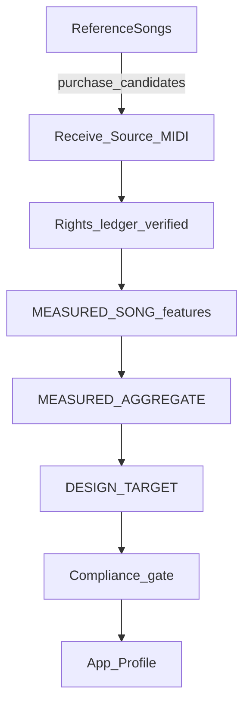

# 市販楽曲 MIDI 分析ワークフロー

- 版: v1.0（2026-08-03）
- 現状: **Source MIDI 未提供 → 曲分析は実行しない。本文書は受領後の手順。**

## Phase 0 — 準備（いまここ）

1. 方針・スキーマ・ローカル構成を用意する（本ディレクトリ）
2. Reference Songs は曲名リストのまま維持する
3. 聴取観点は `listening_analysis_guide.md`（結果ではない）

完了条件: 文書・スキーマ・gitignore・README が揃い、実測件数が 0 と明記されていること。

## Phase 1 — Source MIDI 受領

1. ユーザーが `LocalDatasets/CommercialSongMidi/<Style>/` へ配置
2. 権利情報を台帳に記入し `verificationStatus: verified` のみ解析対象にする
3. SHA256 とファイル名を台帳へ（任意だが推奨）
4. 未検証・拒否はスキップし、次の曲へ進む（パイプラインを止めない）

## Phase 2 — Measured Song Features

1. SMF をパース（既存 `src/lib/performance/library/ingest/smf.ts` を拡張利用可）
2. パート分離（chord / bass / drums / other）。メロディ候補は分析するが製品へ載せない
3. [`song_analysis.schema.json`](./song_analysis.schema.json) に従って JSON を出力
4. 保存: `LocalAnalysis/song_features/<songId>.json`（git 外推奨）と、要約のみ docs へ（方針に従う）
5. 各フィールドに `evidence: MEASURED_SONG` を付ける

測定の最小セット（指示書 1.3）:

- 発音位置（グリッド相対）
- 音価分布
- ベロシティ分布
- ボイシング移動量
- ベースのルート率
- キックとベースの同時／関係
- 小節単位の密度変化

## Phase 3 — Style Aggregate

1. 同一スタイルで **複数曲**（目安: 最低 3 曲、理想はスタイル曲数の過半）が揃ってから集約
2. 1 曲だけの特徴をスタイル全体へ一般化しない
3. [`style_aggregate.schema.json`](./style_aggregate.schema.json) に出力
4. ラベルは `MEASURED_AGGREGATE`

## Phase 4 — Engine Design Target

1. Aggregate を参考に Chord Palette 用値を設計する（コピーしない）
2. 考慮: 任意進行への適用性、再生安定、音源相性、UI、スタイル差、原曲類似の防止
3. ラベルは `DESIGN_TARGET`
4. 根拠リンク: どの Aggregate フィールドを参照したか

## Phase 5 — App Profile と反映ゲート

1. [`app_profile_manifest.schema.json`](./app_profile_manifest.schema.json) を作成
2. [`app_reflection_compliance.md`](./app_reflection_compliance.md) を全項目チェック
3. 承認後にのみ `src/lib/performance/` 等へ小変更
4. 元 MIDI・固有フレーズはアプリに入れない

## Phase 6 — 聴感妥当性（Reference Songs）

1. 生成伴奏を Reference Songs の方向性に照らして聴く（`USER_LISTENING`）
2. 「原曲に似すぎる」場合は Design Target を丸める（コピー方向へ戻さない）

## ローカルパス

詳細: [`local_layout.md`](./local_layout.md)
